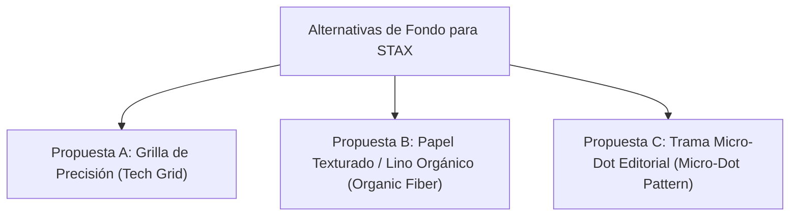

# Propuestas de Fondos y Entramados: Textura Visual para el Mercado Chileno

Este documento detalla tres propuestas de texturas y entramados visuales para la página principal ([index.html](file:///home/manager/Sync/python_proyects/web_promotion/index.html)) de STAX. El objetivo es romper la sensación de "desnudez" o "sitio básico" aportando profundidad, tactilidad y un acabado premium, todo bajo los estándares del usuario chileno (quien valora la limpieza pero rechaza las plantillas planas y frías).

---

## 1. Fundamentos de Textura Visual (Preferencia Local)

Según nuestra investigación en [investigacion_diseños_populares.md](file:///home/manager/Sync/python_proyects/web_promotion/investigacion_dise%C3%B1os_populares.md) y tendencias web en Chile:
1. **La Frialdad del 'Flat Design'**: Los fondos de color plano puro se perciben hoy como "plantillas baratas" o "sitios incompletos".
2. **Texturas Orgánicas y Estructuradas**: El usuario chileno prefiere entramados geométricos muy finos (grillas de ingeniería, puntos sutiles) o texturas que recuerden a papel premium o fibra, ya que humanizan la interfaz tecnológica.
3. **Control de Contraste**: Los fondos deben ser sutiles. La textura debe actuar a nivel subconsciente, sin interferir nunca con la legibilidad del texto en dispositivos móviles.

---

## 2. Las 3 Propuestas de Entramado

A continuación se presentan las 3 alternativas técnicas de diseño:



---

### 🎨 Propuesta A: Grilla de Precisión (Estética Técnica/Ingeniería)
* **Concepto**: Un patrón de líneas finas ortogonales que evoca un plano arquitectónico, planificación y precisión. Ideal para transmitir orden, seriedad y desarrollo técnico de calidad.
* **Implementación CSS**:
  ```css
  .bg-precision-grid {
    background-image: 
      linear-gradient(rgba(var(--drac-current), 0.08) 1px, transparent 1px),
      linear-gradient(90deg, rgba(var(--drac-current), 0.08) 1px, transparent 1px);
    background-size: 40px 40px;
  }
  ```
* **Efecto**:
  * **Modo Claro**: Da un aire de "portafolio de arquitectura" o "blueprint corporativo" de alta gama.
  * **Modo Oscuro**: Emula un panel de ingeniería o editor de código avanzado.

---

### 🍃 Propuesta B: Lino Orgánico y Papel Texturado (Estética Humana)
* **Concepto**: Rompe la perfección del píxel plano aplicando una textura de grano de fibra natural (como papel reciclado de alto gramaje o tela de lino). Transmite cercanía, autenticidad y calidez.
* **Implementación CSS**:
  ```css
  .bg-organic-fiber {
    position: relative;
  }
  .bg-organic-fiber::before {
    content: "";
    position: absolute;
    inset: 0;
    opacity: 0.18;
    pointer-events: none;
    background-image: url("data:image/svg+xml,%3Csvg viewBox='0 0 200 200' xmlns='http://www.w3.org/2000/svg'%3E%3Cfilter id='noise'%3E%3CfeTurbulence type='fractalNoise' baseFrequency='0.8' numOctaves='3' stitchTiles='stitch'/%3E%3C/filter%3E%3Crect width='100%25' height='100%25' filter='url(%23noise)'/%3E%3C/svg%3E");
  }
  ```
* **Efecto**: Transforma la superficie del sitio haciéndola ver "táctil", como si el contenido estuviera impreso sobre papel fino. Se complementa con sombras de borde muy suaves.

---

### 📄 Propuesta C: Trama Micro-Dot Editorial (Estética Revista/Boutique)
* **Concepto**: Una grilla de puntos muy pequeños con espaciado denso que recrea el entramado de impresión de una revista de lujo o catálogo editorial. Es el estilo preferido por agencias chilenas de branding boutique.
* **Implementación CSS**:
  ```css
  .bg-micro-dots {
    background-image: radial-gradient(rgba(var(--drac-fg), 0.04) 1.5px, transparent 1.5px);
    background-size: 16px 16px;
  }
  ```
* **Efecto**: Aporta una textura visual refinada y homogénea. Al ser muy pequeña, es casi invisible de lejos, pero de cerca le quita toda la frialdad al fondo de color plano.

---

## 3. Sugerencia de Integración Híbrida (Recomendada)

Para lograr el máximo nivel estético sin saturar la página, sugerimos **combinar los patrones** en distintas secciones para crear ritmo visual:
* **Fondo del Body General**: Usar la **Propuesta C (Micro-dots)** en todo el fondo para dar una base editorial limpia.
* **Hero Section & Contacto (Conversiones)**: Usar la **Propuesta B (Papel/Noise)** combinada con las esferas de luz difusas (`mesh-bg`) para dar profundidad premium en las zonas de captación.
* **Demos & Proceso (Estructura)**: Usar la **Propuesta A (Grilla)** para reforzar visualmente el orden y la tecnología de las demos.

---

## 4. Instrucción de Feedback

¿Cuál de las propuestas visuales te atrae más para que procedamos a codificar sus estilos e implementarla en el fondo principal del sitio?
