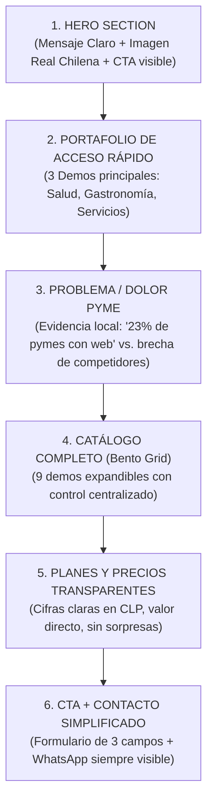

# Propuesta de Rediseño: Enfoque y Composición para el Mercado Chileno

Esta propuesta presenta un nuevo enfoque estratégico, estético y de composición para la landing page principal ([index.html](file:///home/manager/Sync/python_proyects/web_promotion/index.html)), fundamentado en los hallazgos de nuestros estudios de mercado locales: [investigacion_diseños_populares.md](file:///home/manager/Sync/python_proyects/web_promotion/investigacion_dise%C3%B1os_populares.md) y [research_sitios_web_chile.md](file:///home/manager/Sync/python_proyects/web_promotion/research_sitios_web_chile.md).

---

## 1. Fundamentos del Comportamiento del Usuario Chileno

Según la evidencia recopilada en nuestras investigaciones de mercado:
1. **Regla de los 3 Segundos (Decisión de Rebote)**: El usuario chileno decide casi de inmediato si continúa navegando. Por ende, la propuesta de valor y el botón de acción principal (CTA) deben ser visibles arriba del pliegue (*above the fold*) sin necesidad de scroll.
2. **Preferencia de Contraste y Seriedad**: Aunque el "Modo Oscuro" (Dracula Theme) es muy valorado en nichos de tecnología, el público objetivo real (dueños de PYMEs, profesionales independientes y comercios tradicionales en Chile) prefiere **fondos claros, limpios y paletas de colores sobrias** que transmitan formalidad y transparencia institucional.
3. **Predominancia Móvil Absoluta**: Con un **98,9%** de conexiones a internet vía smartphones (SUBTEL, 2024), la composición debe estar pensada de manera prioritaria para celulares, usando áreas de contacto (tap targets) grandes y tipografías legibles al sol.

---

## 2. Nueva Propuesta de Paleta Cromática (Branding Local)

Proponemos una transición hacia una paleta **Premium Corporativo Orgánico**, que combine la formalidad exigida en el mercado chileno con acentos que evoquen confianza y modernidad:

| Color / Variable | Tono Propuesto | Significado y Percepción |
|---|---|---|
| **Fondo Principal** (`--drac-bg`) | **Blanco Alabastro / Lino** (`#F5F5F2`) | Suavidad visual, limpieza y legibilidad premium (evita el blanco puro que fatiga la vista). |
| **Texto de Contraste** (`--drac-fg`) | **Negro Carbón / Pizarra** (`#1E2022`) | Alta legibilidad bajo luz solar directa en dispositivos móviles. |
| **Identidad Base (Azul)** (`--drac-cyan`) | **Azul Pacífico / Institucional** (`#1F3A60`) | Representa seguridad, solidez y seriedad. Es el color más validado corporativamente en Chile. |
| **Acento de Éxito (Verde)** (`--drac-green`) | **Verde Bosque Valdiviano** (`#2D5A27`) | Asociado con salud, crecimiento y cercanía. Funciona excelente para botones de WhatsApp y éxito de conversión. |
| **Acento de Prestigio** (`--drac-orange`) | **Cobre / Bronce Metalizado** (`#A35D22`) | Evoca el mineral identitario de Chile, aportando un toque de lujo, artesanía y calidez local. |

---

## 3. Composición y Flujo de la Estructura (Layout)

Proponemos reorganizar la estructura jerárquica de la página para dirigir al usuario de manera natural desde la propuesta de valor hasta la conversión directa por WhatsApp o formulario:

### Detalle de Secciones:

1. **Hero Section (Full-screen con alineación izquierda)**:
   * **Título**: Un gancho directo: *"Páginas web que tu cliente entiende al primer vistazo. Diseñadas en Chile para vender más."*
   * **Visual**: En lugar de renders abstractos de código, una foto real de un negocio local chileno o una interfaz de demo en uso.
   * **CTA primario**: Botón verde destacado: *"Ver demos en vivo"* y secundario: *"Conversar en WhatsApp"*.
2. **Portafolio Destacado (Showcase Inicial)**:
   * Muestra únicamente las 3 plantillas de mayor conversión en el mercado (Psicóloga, Café de Especialidad, y Servicios B2B). Las demás se ocultan tras el botón selector.
3. **Bloque de Credibilidad (El dolor de la PYME)**:
   * Destacar el dato de la Cámara de Comercio de Santiago (CCS): *"Solo 2 de cada 10 PYMEs en Chile tienen web propia. Destaca frente a tus competidores hoy mismo."*
4. **Calculadora Tributaria / Planes de Precios en CLP**:
   * Mostrar tarifas transparentes y reales expresadas en pesos chilenos (CLP) con rango de inversión (ej. desde $300.000 CLP). En Chile, ocultar el precio genera desconfianza y reduce la conversión inmediata.

---

## 4. Adaptaciones Clave para la Conversión Chilena

1. **WhatsApp como Núcleo de Conversión**: El usuario chileno prefiere la inmediatez del chat frente a formularios de correo electrónico. La plantilla debe contar con:
   * **Mensajes pre-cargados dinámicos** según el plan o demo visitada:
     * *Ejemplo*: `https://wa.me/...&text=Hola, vi la demo de la Psicóloga y quiero cotizar una web similar...`
2. **Formularios Sin Fricción**: Un formulario de contacto simplificado a solo 3 campos críticos:
   * Nombre
   * WhatsApp / Teléfono
   * ¿Cuál es tu negocio o rubro? (para preparar la propuesta)
3. **SEO Local Visible**: Integrar un bloque con mapa de Google (usando la sintaxis `!` compatible) que muestre la cobertura del servicio en Chile (ej. "Diseño Web en Santiago, despacho a regiones").

---

## 5. Próximos Pasos Sugeridos

¿Quieres que procedamos a implementar esta estructura de diseño clara (Light Theme optimizado) y adaptemos los textos del Hero para enfocarlos de manera más directa al mercado de PYMEs chilenas?
